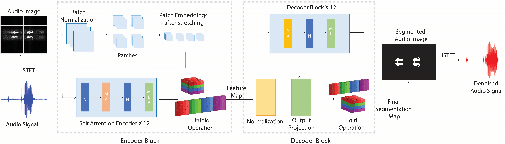
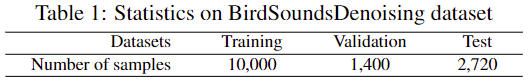
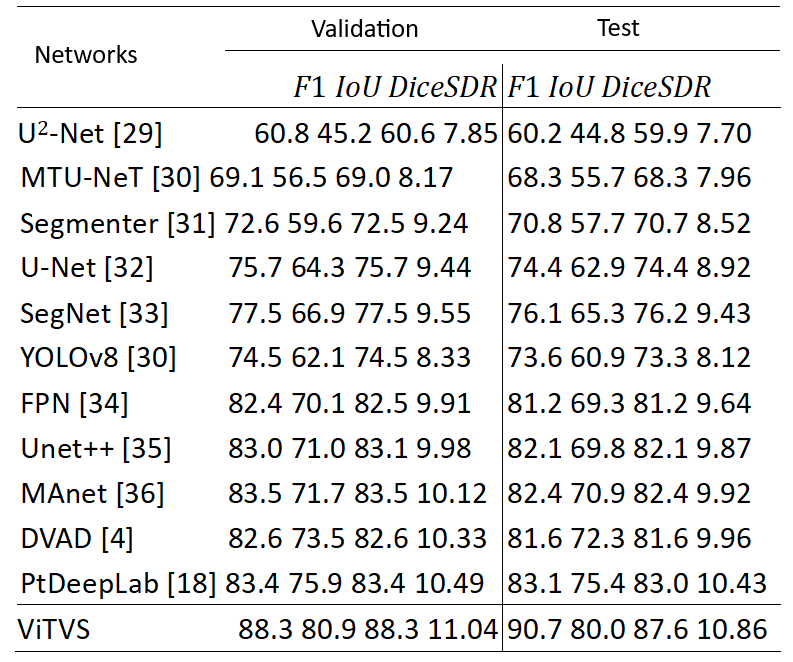

Audio denoising, especially in the context of bird sounds, remains a challenging task due to persistent residual noise. Traditional and deep learning methods often struggle with artificial or low-frequency noise. In this work, we propose ViTVS, a novel approach that leverages the power of the vision transformer (ViT) architecture. ViTVS adeptly combines segmentation techniques to disentangle clean audio from complex signal mixtures. Our key contributions encompass the development of ViTVS, introducing comprehensive, long-range, and multi-scale representations. These contributions directly tackle the limitations inherent in conventional approaches. Extensive experiments demonstrate that ViTVS outperforms state-of-the-art methods, positioning it as a benchmark solution for real-world bird sound denoising applications.

# Model Architecture for Vision Transformer Segmentation for Visual Bird Sound Denoising

   

  The overview of our ViTVS architecture. The encoder comprises a sequence of self-attention encoder blocks, each executing normalization, patch creation, and embedding layers. The decoder mirrors the encoder with additional operations, including unfolding and output projection, culminating in the final segmentation map. Both encoder and decoder consist of 12 blocks.

### Datasets
The BirdSoundsDenoising dataset is available at [this link](https://doi.org/10.5281/zenodo.7191406).

In training and valid folders, the data structure is:

-------------Training/Valid

------------------Denoised_audios

------------------Images

------------------Masks

------------------Raw_audios

Raw_audios contain all noise bird sounds. Images are converted STFT noise bird sound images, and Masks are the labled clean sound areas. Denoised_audios are the denoised bird sound audios.

   

### Results

   

